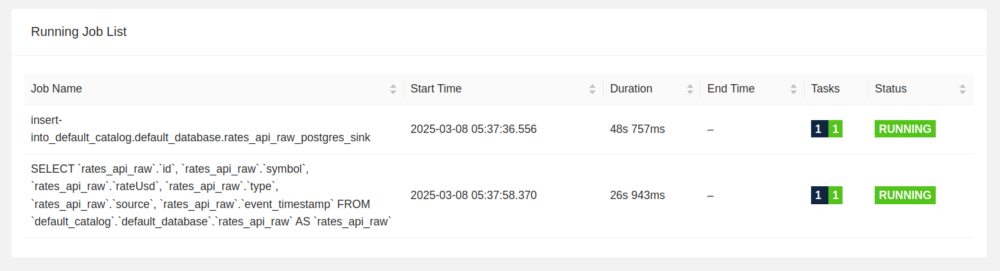
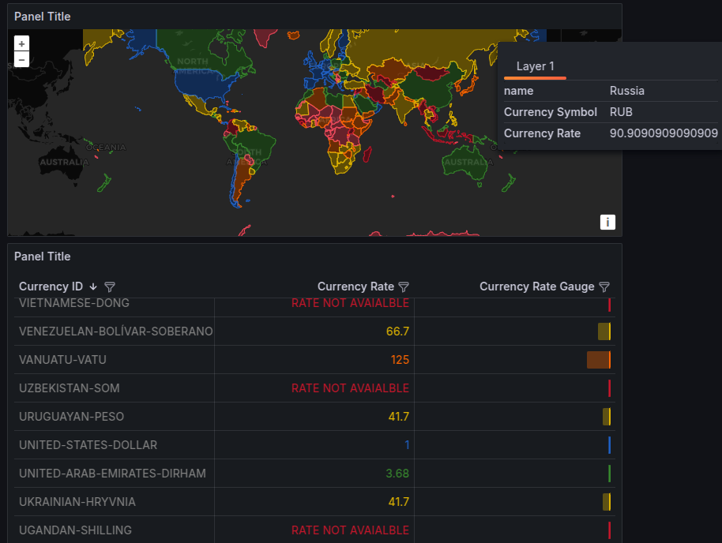

# CoinCap Data Engineering Project  

## Overview  
This project is a data engineering pipeline for ingesting, processing, and analyzing cryptocurrency market data from the CoinCap API. The goal is to extract real-time data on different crypto currencies store it in a relational database in Fact and Dimension tables and view the data in a dashboard in real time. Apart from this another Dashboard is also presented to view data on exchange rates of different currncies.   

The data is obtained from the CoinCap API.

The documentation is available at :- https://docs.coincap.io/#d8fd6001-e127-448d-aadd-bfbfe2c89dbe


## Technology Stack 

A conscious choice has been made to avoid deploying anything on the cloud simply to save costs.
Also the volume of data involved is less as it is real time streaming data and can be handled locally 
without any signup hassles for a cloud account.  

The tech stack used for this project is as follows 

### 1) Docker 

This is the backbone of the Technology Stack and everything is containerized to ensure reproducibilty

### 2) Kafka 

Kafka is used to store data received from the CoinCap API using a pub-sub model, where downstream applications can subscribe to and consume these messages in real-time 

### 3) Apache Flink

Apache Flink, an open-source stream processing framework, consumes real-time messages from Kafka to enable efficient stream processing and analytics on cryptocurrency data, providing low-latency insights and supporting complex event-driven applications

Apache Flink has a source table that stores messages from Kafka and sink table connected to Postgres.
A Flink job inserts data from source to sink effectively pushing data to Postgres DB

### 4) Postgres DB

The Database of choice to finally store the data is POstgres DB 

### 5) DBT 

DBT is then used to model the raw into fact and dimension tables 

### 6) Grafana

Grafana is the tool of choice to visualize the data. It gives a Web UI to biuld visulizations nd add them to Dashbaords.
These dashboards can be saved in JSON format. Dashboards developed have been added below . 

### 7) Kestra

Kestra is used as the entire orcestartion software.  It orchesstrates python scripts to fetch data from the API and push it 
to Kafka, as well as DBT , Grafana and archiving scripts. 

## Architecture


## Project Structure  

1) Data Moldelling Docs :- This folder contains the data model for the project. It contains the Data Model diagram and the data dictionary for the project. 

2) Images :- This folder contains the images used in the ReadMe file.

3) LocalSetup :- This folder contains the docker-compose file to setup the entire project locally.
   
    3.1) Airflow :- This folder contains all files related to airflow. It is to be ignored for this project as Kestra is used for orchestration.

    3.2) db-init :- This folder contains the sql scripts to initialize different databases
        used in this project.

    3.3) dbt :- This folder contains the dbt project to model the raw data into fact and dimension tables.

    3.4) dbt_project :- This folder contains the dbt project to model the raw data into fact and dimension tables.

    3.5) flink :- This folder contains the docker file to setup the flink environment as well as the flink job to push data from source to sink.

    3.6) grafana :- This folder contains the json files for the dashboards created in Grafana.
    It also contains files to connect grafana to postgres.

    3.7) kestra :- This folder contains the kestra project to orchestrate the entire project.
    This folder contains two main types of files:
        3.7.1) Jobs :- These are scripts ie python or SQL that are executed by Kestra.
        3.7.2) Flows :- These are the orchestration files that define the flow of the project.

    3.8) .env :- This file contains the environment variables used in the project.
    The mostly comprise of usernames and passwords for the different databases used in the project.

    3.9) docker-compose.yml :- This file is used to setup the entire project locally.

    3.10) prestart.sh :- This file is used to setup the project before starting the docker-compose file. It is used to move files to the correct location for Kestra to function properly.

4) Miscaellaneous :- This folder contains commom commands used to test things in the course of the project.

5) ReadMe.md :- This file contains the documentation for the project.
        

### Steps to run the project locally

1) Clone the repository to your local machine.
    `git clone https://github.com/hravat/coincap-de-project.git`

2) Navigate to directory Local Setup and replace the username after /home with your username.<br>
   Run the prestart.sh file to setup the project.
   
    `./prestart.sh`

3) Navigate to directory Local Setup/Kestra and run the command to build the kestra-python image.
    `docker build -t kestra-python-image -f dockerfile.kestra.python .`

3) Navigate to directory Local Setup and run the command to build the kestra-dbt image.
    `docker build -t kestra-dbt-image -f dockerfile.kestra.dbt .`

4) Navigate to .env folder and set up username and password for the databases.
   (Please avoid changing username and passwords if possible)

5) Set KESTRA_SECRET_DWH_DB_PASSWORD with the folloing command. 
   This is used in the file dbt_flow.yml  
    `echo -n <coincap password> | base64`    

6) The password for COINCAP Database needs to be hardcoded in 
    the file /kestra/flows/rate_api_archive.yml

7) Run the docker-compose file to setup the entire project.
    `docker compose up -d`

8) Run the below command to start sqk=l-client to flink 
    `docker compose run sql-client`

9) After the client is up enter the following query at flink/sql/flink_jobs.sql
    
    ```
    insert
	into
	rates_api_raw_postgres_sink (id,
	symbol,
	rateUsd,
	type,
	source,
	event_timestamp)
    select
    	id,
    	symbol,
    	rateUsd,
    	type, 
    	source,
    	event_timestamp
    from
    	rates_api_raw;
    ```


### Commands to test if the services are running 


1) Testing the Kafka Service (In terminal)
    
```
docker exec -it broker kafka-console-consumer \
--bootstrap-server broker:9092 \
--topic rates-api --from-beginning --max-messages 3

```


2) Testing the Flink Service (In Flink SQL Client)

```
select * from rates_api_raw;

```


Go to the url

```
http://localhost:8081/#/overview

```



3) Testing Kestra Service 

Go to the url 
```
http://localhost:8085/ui/dashboards/default

```


Here you could check each flow individually for errors.
For DBT the status may show sucess even if the job may have failed.
This needs to be checked in the logs.


4) Testing the DBT Service 

To check the status of the DBT job run inspect the respective flow in Kestra UI.
Check for success status by actaully opening and inspecting the logs 


5) Testing the Postgres Service

Connect to the Postgres DB using (I prefer using DBeaver)
Connect to the coincap_dwh database and run below queries 
to check if DBT transformation has been successful


```
select * 
from coincap_prod.fact_currency_rate fcr 
order by event_timestamp desc; 
```


```
select * 
from coincap_prod.dim_currency_rate; 
```


6) Testing the Grafana Service

Go to the url 
```
http://localhost:3000/login

```
Check if the crypto dashboards show real time data updates 





### Future Work

1) Changes can be made to the project to deploy it to the cloud.<br>
    This involves substatntial changes to the entire project.

2) At present only one API from CoinCap is implemented.
   More APIs can be implemented to get more variety of data.<br>
   This should be less challenging as the entire framework is in place.<br>
   It would involve adding more flows to Kestra and more tables to Postgres and DBT
   and more flink jobs.<br>
   Finally new dashbaords also can be created in Grafana.

### Acknowledgements

This project uses docker-compose file from the following open-source repository:

PLEASE NOTE THIS IS ONLY USED TO SET UP FLINK SERVICES IN DOCKER FOR THIS PROJECT


--https://dev.to/ftisiot/build-a-streaming-sql-pipeline-with-apache-flink-and-apache-kafka-53jg 
--https://github.com/aiven/sql-cli-for-apache-flink-docker.git


